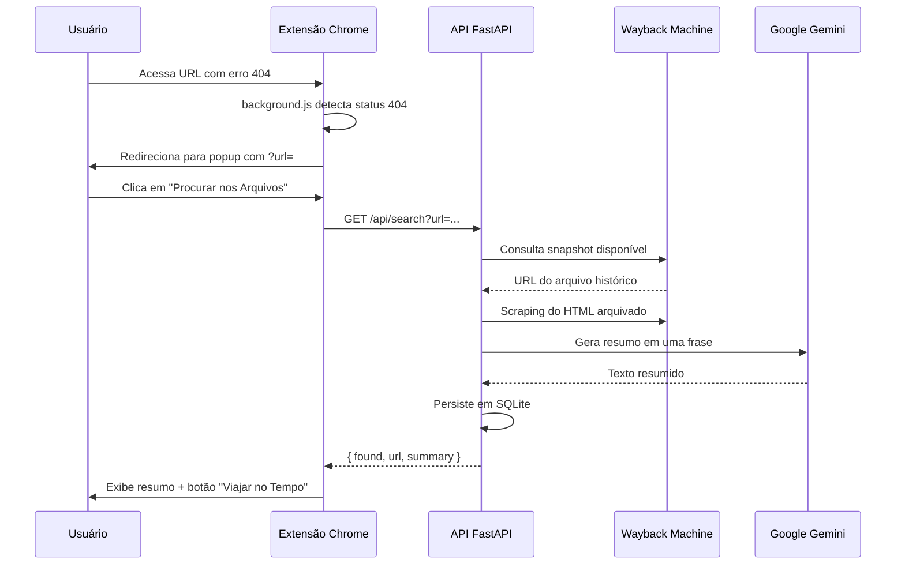

# ⏳ 404 Time Machine


Uma extensão de navegador Full Stack que ressuscita links mortos. Ao esbarrar em uma página com Erro 404, a extensão intercepta a navegação, busca a última versão válida no [Internet Archive (Wayback Machine)](https://web.archive.org/) e utiliza IA para gerar um resumo do que aquele site costumava ser.

## 🌐 API em Produção

- **Back-end (Render):** https://time-machine-api-q463.onrender.com
- **Documentação interativa (Swagger):** https://time-machine-api-q463.onrender.com/docs

> A extensão consome a API hospedada no Render por padrão. Para desenvolvimento local, aponte as requisições para `http://localhost:8000` (veja a seção de configuração abaixo).

## ✨ Funcionalidades

- **Interceptação Automática:** O service worker da extensão detecta erros 404 em tempo real via `chrome.webRequest` e redireciona o usuário para a interface da Máquina do Tempo, sem prejudicar a navegação normal.
- **Resumo com IA:** Integração com o Google Gemini (`gemini-2.5-flash`) para ler a página arquivada e explicar o contexto do site em uma frase curta.
- **Memória de Resgates:** Histórico persistente salvo em SQLite via SQLAlchemy, com os 10 resgates mais recentes disponíveis para consulta.
- **Internacionalização (i18n):** Interface bilíngue (PT-BR e EN-US) nativa no React com `react-i18next`.

## 🚀 Tecnologias Utilizadas

### Front-end (Extensão Chrome)
- React 19 + Vite 8
- `@crxjs/vite-plugin` para build da extensão (Manifest V3)
- `react-i18next` para internacionalização
- Service Worker (`background.js`) para interceptação de 404

### Back-end (API)
- Python + FastAPI
- Uvicorn como servidor ASGI
- SQLite + SQLAlchemy para banco de dados relacional
- Google Generative AI (Gemini 2.5 Flash) para NLP
- BeautifulSoup4 para web scraping das páginas arquivadas
- Requests para consumo da API do Wayback Machine

### Infraestrutura
- **Banco de dados:** SQLite local (`historico.db`) — criado automaticamente na primeira execução.
- **Hospedagem da API:** [Render](https://render.com/).

## 📁 Estrutura do Projeto

```bash
.
├── time-machine-api/       # API FastAPI (busca no Archive + resumo IA + histórico)
│   ├── main.py             # Endpoints /api/search e /api/history
│   ├── database.py         # Modelo SQLAlchemy e conexão SQLite
│   └── requirements.txt    # Dependências Python
├── time-machine-app/       # Extensão Chrome (React + Manifest V3)
│   ├── manifest.json       # Configuração da extensão
│   ├── src/
│   │   ├── App.jsx         # Interface principal (busca + histórico)
│   │   ├── background.js   # Interceptação de erros 404
│   │   └── i18n.js         # Traduções PT-BR / EN-US
│   └── vite.config.js      # Build com CRXJS
└── .gitignore
```

## 🛠️ Como rodar o projeto localmente

### Pré-requisitos

- [Python 3.10+](https://www.python.org/downloads/)
- [Node.js 18+](https://nodejs.org/)
- [Google Chrome](https://www.google.com/chrome/) (ou navegador compatível com Manifest V3)
- Chave de API do [Google AI Studio](https://aistudio.google.com/apikey) (Gemini)

### 1. Clonar o repositório

```bash
git clone https://github.com/Depaula18/time-machine-api
cd time-machine-api
```

### 2. Configurar e executar a API

```bash
cd time-machine-api
python -m venv venv
```

**Windows (PowerShell):**

```powershell
.\venv\Scripts\Activate.ps1
pip install -r requirements.txt
```

**Linux / macOS:**

```bash
source venv/bin/activate
pip install -r requirements.txt
```

Crie o arquivo `.env` na pasta `time-machine-api/`:

```env
GEMINI_API_KEY=sua_chave_aqui
```

Inicie o servidor:

```bash
uvicorn main:app --reload --port 8000
```

A API ficará disponível em:
- `http://localhost:8000`
- Swagger: `http://localhost:8000/docs`

### 3. Configurar e executar a extensão

Em outro terminal:

```bash
cd time-machine-app
npm install
npm run dev
```

Para instalar a extensão no Chrome durante o desenvolvimento:

1. Acesse `chrome://extensions/`
2. Ative o **Modo do desenvolvedor**
3. Clique em **Carregar sem compactação**
4. Selecione a pasta `time-machine-app/dist` gerada pelo Vite

Para build de produção da extensão:

```bash
npm run build
```

Depois, carregue a pasta `dist/` no Chrome da mesma forma.

### 4. Apontar a extensão para a API local (opcional)

Por padrão, o front-end consome a API em produção no Render. Para usar a API local, altere as URLs em `time-machine-app/src/App.jsx`:

```javascript
// De:
'https://time-machine-api-q463.onrender.com/api/history'
'https://time-machine-api-q463.onrender.com/api/search?url=...'

// Para:
'http://localhost:8000/api/history'
'http://localhost:8000/api/search?url=...'
```

## 🔐 Variáveis de Ambiente (Back-end)

| Variável         | Obrigatória | Descrição                                      |
| ---------------- | ----------- | ---------------------------------------------- |
| `GEMINI_API_KEY` | Sim         | Chave de API do Google Gemini (Google AI Studio) |

Exemplo (PowerShell):

```powershell
$env:GEMINI_API_KEY="sua_chave_aqui"
uvicorn main:app --reload --port 8000
```

> **Importante:** nunca commite o arquivo `.env` com chaves reais. Ele já está listado no `.gitignore`.

## 📡 Endpoints da API

| Método | Rota           | Descrição                                                        |
| ------ | -------------- | ---------------------------------------------------------------- |
| `GET`  | `/api/search`  | Busca snapshot no Wayback Machine, gera resumo IA e salva no banco |
| `GET`  | `/api/history` | Retorna os 10 resgates mais recentes                             |

**Exemplo de busca:**

```bash
curl "http://localhost:8000/api/search?url=https://exemplo.com/pagina-morta"
```

## 🧪 Scripts Úteis

### Front-end (`time-machine-app`)

```bash
npm run dev      # desenvolvimento da extensão (Vite + CRXJS)
npm run build    # build de produção (pasta dist/)
npm run preview  # preview do build
npm run lint     # lint com ESLint
```

### Back-end (`time-machine-api`)

```bash
uvicorn main:app --reload --port 8000   # servidor de desenvolvimento
pip install -r requirements.txt         # instalar dependências
```

## 🔄 Fluxo da Aplicação



## 📌 Roadmap (Sugestões)

- Externalizar a URL da API para variável de ambiente (`VITE_API_BASE_URL`).
- Adicionar testes automatizados (unitários e integração) para API e extensão.
- Configurar CI/CD para build, lint e deploy automático.
- Publicar a extensão na Chrome Web Store.

## Política de Privacidade
- Esta extensão coleta e armazena apenas as URLs que resultam em erros 404 para o propósito exclusivo de buscar suas versões arquivadas. Nenhum dado de identificação pessoal do usuário é coletado, armazenado ou compartilhado com terceiros.

## 👨‍💻 Autor

Murilo de Paula — [@Depaula18](https://github.com/Depaula18)

Projeto desenvolvido para fins de estudo e prática de arquitetura Full Stack com Python, FastAPI e React.

## 📄 Licença

Este projeto está sob a licença MIT.
